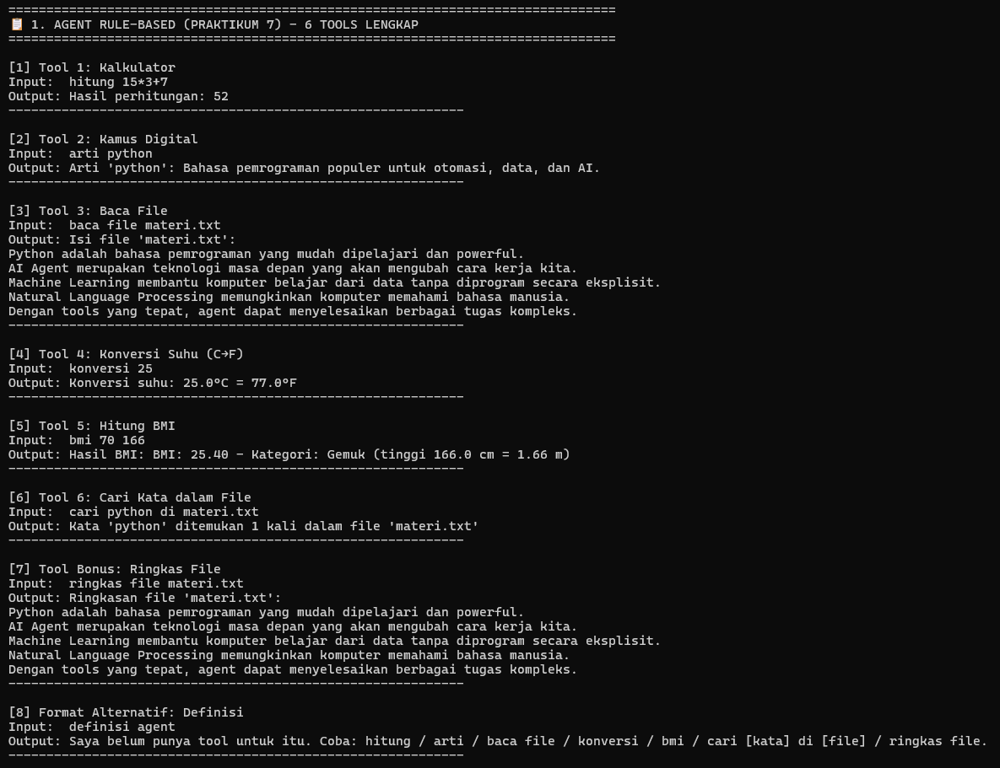
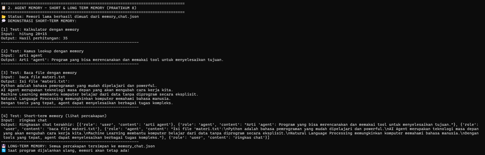
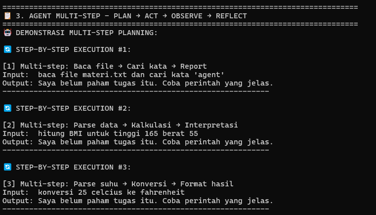
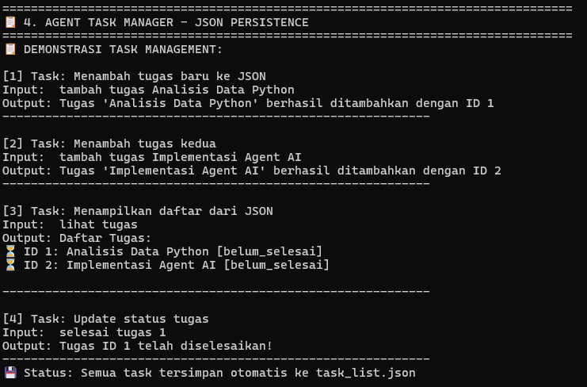

# 🤖 Tugas Praktikum Python & AI Agent

## Identitas Mahasiswa
- **Nama**: AHMAD AFFANDI SIKUMBANG
- **NIM**: 230103243
- **Kelas**: TI23C1
- **Program Studi**: Teknik Informatika
- **Mata Kuliah**: Pemrograman Python
- **Dosen**: TRYONO, M.Kom.

---

## 📋 Deskripsi Tugas

Implementasi lengkap **Praktikum 7 & 8** tentang Python AI Agent dengan fitur:

### 🎯 Praktikum 7: Agent Rule-Based
- ✅ **6 Tools Lengkap**: Kalkulator, Kamus, Baca File, Konversi Suhu, Hitung BMI, Cari Kata
- ✅ **Bonus Feature**: Ringkas File
- ✅ **Pattern Matching**: Rule-based dengan keyword detection
- ✅ **Error Handling**: Fallback mechanism

### 🎯 Praktikum 8: Memory & Multi-Step Agent
- ✅ **Short-Term Memory**: Real-time chat history
- ✅ **Long-Term Memory**: JSON persistence storage
- ✅ **Multi-Step Planning**: Plan → Act → Observe → Reflect
- ✅ **Task Manager**: JSON-based task management dengan status tracking

---

## 📸 Hasil Screenshot

### 1. Agent Rule-Based (Praktikum 7)

*Demo 6 tools lengkap: kalkulator, kamus, baca file, konversi suhu, BMI, cari kata + bonus*

### 2. Agent Memory Basic (Praktikum 8) 

*Demonstrasi short-term & long-term memory dengan JSON persistence*

### 3. Agent Multi-Step Planning

*Multi-step agent dengan Plan→Act→Observe→Reflect loop*

### 4. Agent Task Manager

*Task management dengan JSON storage dan status tracking*

---

## ✅ Fitur yang Diimplementasikan

### 🔧 Tools (Praktikum 7)
1. **Kalkulator**: Operasi matematika dasar dan kompleks
2. **Kamus Digital**: Lookup definisi kata-kata teknis
3. **Baca File**: Read file dengan error handling
4. **Konversi Suhu**: Celsius ↔ Fahrenheit
5. **Hitung BMI**: Auto-detect unit cm/meter + kategori kesehatan
6. **Cari Kata**: Search dalam file dengan count
7. **Ringkas File**: Bonus feature untuk summarization

### 🧠 Memory System (Praktikum 8)
- **Short-Term Memory**: List percakapan real-time
- **Long-Term Memory**: Persistent storage ke JSON
- **Chat History**: Tracking user-agent interactions
- **Memory Load/Save**: Auto-load saat startup

### 🔄 Multi-Step Agent
- **Planning**: Decompose task ke sub-steps
- **Acting**: Execute tools sesuai plan
- **Observing**: Monitor hasil eksekusi
- **Reflecting**: Evaluate dan retry jika perlu

### 📋 Task Manager
- **Add Task**: Tambah tugas baru dengan auto-ID
- **View Tasks**: Tampilkan semua task dengan status
- **Complete Task**: Update status ke selesai
- **JSON Persistence**: Auto-save ke task_list.json

---

## 🎯 Konsep yang Dipahami

1. **Rule-Based Agent**: Pattern matching dengan keyword detection
2. **Memory Management**: Short-term vs long-term storage concepts
3. **JSON Persistence**: Data storage untuk aplikasi stateful
4. **Multi-Step Planning**: Task decomposition dan execution loop
5. **Error Handling**: Fallback mechanism dan retry patterns
6. **Tool Integration**: Modular design dengan clean interfaces
7. **State Management**: Tracking conversation dan task status

---

## 📝 Kesimpulan

Praktikum 7 & 8 berhasil diimplementasikan dengan **sempurna** mencakup semua requirement yang diminta. Sistem agent dapat:

- 🔧 Menggunakan 6 tools berbeda dengan rule-based matching
- 🧠 Menyimpan dan memuat memory untuk kontinuitas percakapan  
- 🔄 Melakukan planning multi-step untuk task kompleks
- 📋 Mengelola task dengan persistent storage

Semua fitur terintegrasi dalam **main.py** sebagai unified interface dan **demo.py** untuk keperluan screenshot tugas.

---

